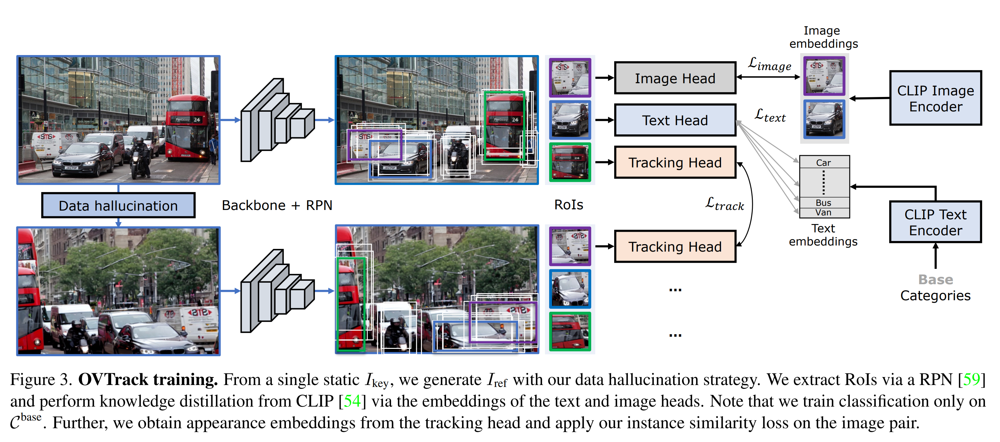
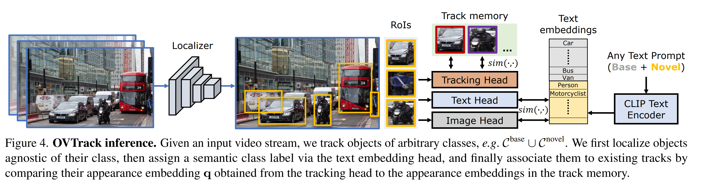

# OVTrack: Open-Vocabulary Multiple Object Tracking
By Siyuan Li, Tobias Fischer, Lei Ke, Henghui Ding, Martin Danelljan, Fisher Yu

Paper: https://arxiv.org/pdf/2304.08408.pdf

Website: https://www.vis.xyz/pub/ovtrack/

Code: https://github.com/SysCV/ovtrack

## Abstract
The ability to recognize, localize and track dynamic objects in a scene is fundamental to many real-world applications, such as self-driving and robotic systems. Yet, traditional multiple object tracking (MOT) benchmarks rely only on a few object categories that hardly represent the multitude of possible objects that are encountered in the real world. This leaves contemporary MOT methods limited to a small set of pre-defined object categories. In this paper, we address this limitation by tackling a novel task, open-vocabulary MOT, that aims to evaluate tracking beyond pre-defined training categories. We further develop OVTrack, an open-vocabulary tracker that is capable of tracking arbitrary object classes. Its design is based on two key ingredients: First, leveraging vision-language models for both classification and association via knowledge distillation; second, a data hallucination strategy for robust appearance feature learning from denoising diffusion probabilistic models. The result is an extremely data-efficient open-vocabulary tracker that sets a new state-of-the-art on the large-scale, large-vocabulary TAO benchmark, while being trained solely on static images. Project page: [this https URL](https://www.vis.xyz/pub/ovtrack/)

## TL;DR;
Propose a new task: Open-vocabulary tracking. The difference with open-world is that open-vocabulary tracking provides "what to track" (new classes) in test time. They solve this problem by training on LVIS (static images + data augmentation + contrastive) using CLIP supervision for the text and image head, generalizing to whatever class. They test on rare classes of TAO to simulate "open-vocabulary," and they outperform other methods that are additionally trained on these rare classes.

## Key ideas
- **Open-vocabulary tracking**: at test-time we know the novel classes we are interested in, and we need to track them. Instead in open-world we do not know the classes to track at test-time and so in open-world we can not compute the precision, only the recall.
- Augmentation is not enough: generate positive and negative samples for data association.

### Schema: Training

### Schema: Inference

## Notes
- Difference between Open-Vocabulary MOT and Open-World MOT is that in the former the object categories are given at test time, while in the latter they are not. This allows to capture the precision of the tracker instead of only the recall.
- **[CLASSIFICATION] Two challenges**: 1. closed-set trackers can not extend their taxonomy. 2. scaling video data annotation to a large vocaulary of classes is extremely costly.
- **[CLASSIFICATION] Solution**: inspired by open-vocalubary *detection*, they replace the classifier with an embedding head to measure similarity between the localized object and an open vocabulary of semantic categories. --> Knowledge distillation from CLIP by aligning the image feature representations of object proposals with the corresponding CLIP image and text embeddings.
- **[ASSOCIATION] Challenges**: Motion is uncertain and complex for unknown objects (and camera movements), appearance seems to be the way to go: diverse objects usually exhibit heterogenous appearance. Relying on appearance cues requires robust representations that generalize to novel object categories
- **[ASSOCIATION] Solution**: They use CLIP feature distillation to learn better appearance presentations for improved association.

## Takeaways
- They define Open-vocabulary MOT upon the TAO benchmark (rare classses)
- They propose a vision-language open-set tracker that is better than closed-set trackers on these (rare classes). 
- To solve the data availability problem they leverage DDPMs for image synthesis. They train on static images only.
- [TETA](https://arxiv.org/abs/2207.12978) is the metric they used for evaluation.
- Training a detector without the class prediction helps in generalizing to the concept of object, demanding the classification task to an open vocabulary classifier (using CLIP for example).