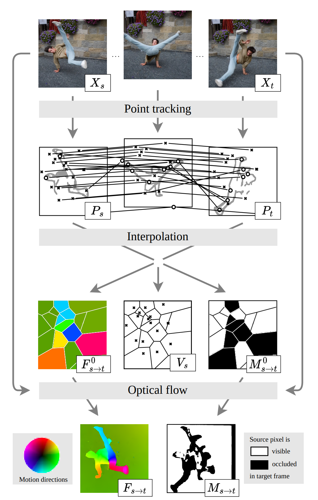

# DOT - Dense Optical Tracking: Connecting the Dots
By Guillaume Le Moing, Jean Ponce, Cordelia Schmid

Paper: https://arxiv.org/pdf/2312.00786.pdf

Code: https://16lemoing.github.io/dot/

Venue: arxiv (at this time (10/12/2023))

## Abstract
- Recent approaches to point tracking are able to recover the trajectory of any scene point through a large portion of a video despite the presence of occlusions. They are, however, too slow in practice to track every point observed in a single frame in a reasonable amount of time. This paper introduces DOT, a novel, simple and efficient method for solving this problem. It first extracts a small set of tracks from key regions at motion boundaries using an off-the-shelf point tracking algorithm. Given source and target frames, DOT then computes rough initial estimates of a dense flow field and visibility mask through nearest-neighbor interpolation, before refining them using a learnable optical flow estimator that explicitly handles occlusions and can be trained on synthetic data with ground-truth correspondences. We show that DOT is significantly more accurate than current optical flow techniques, outperforms sophisticated "universal" trackers like OmniMotion, and is on par with, or better than, the best point tracking algorithms like CoTracker while being at least two orders of magnitude faster. Quantitative and qualitative experiments with synthetic and real videos validate the promise of the proposed approach. Code, data, and videos showcasing the capabilities of our approach are available in the project webpage.

## TL;DR;
- They merge *optical flow* and *Point Tracking* methods. The input is the output of CoTracker (Point Tracking method) made on a small number of points. They spatially interpolate this initial sparse estimate. Finally they predict the dense optical flow similarly to RAFT (optical flow method). This is x100 faster than the slow Point Tracking methods in doing dense prediction, and also more accurate. 

## Key ideas
- They take advantage of both: Point Tracking methods (for their time consistency) and optical flow methods (for their space consistency)
- Notice: Point Tracking methods are slow with high number of points to track. Optical flow methods are fast, but have an high error and do not handle occlusions.
- Solution: they use a small number of points for CoTracker (TAP method), so it still remains fast. And then they use an good initialization for optical flow methods, that are fast and dense in the output.

## Notes
- The initial estiamate from coTracker is sparse and they make it dense with a nearest neighbor interpolation.
- The interpolated map is improved by RAFT (optical flow method) with a recurrent neural network (K=4 steps).
- The network has the primary goal to predict the dense optical flow from frame $s$ to $t$, so jumping frames. You can make it continous predicting with $s=0$ and $t=1,...,T$.

## Takeaways
- Optical flow method and Point Tracking methods are not so far away and they can be interconnected.
- We can make Point Tracking method very FAST. More research is needed.
